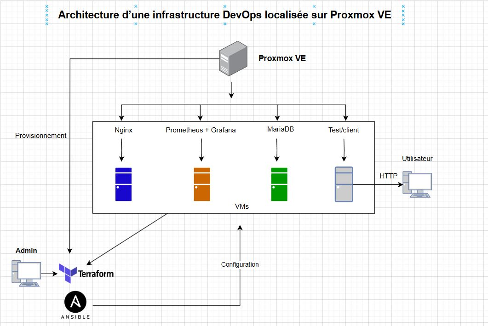
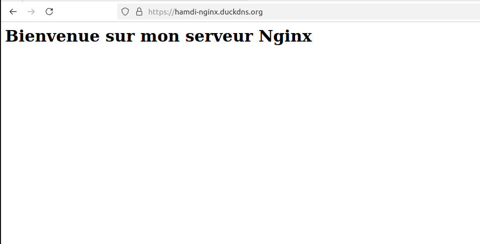
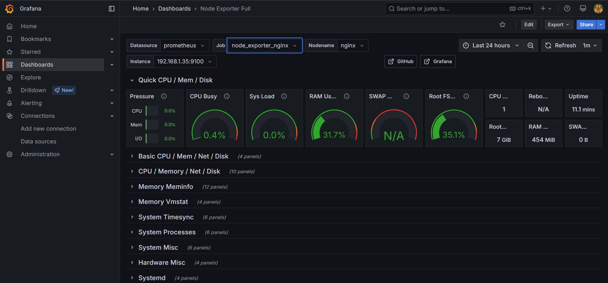
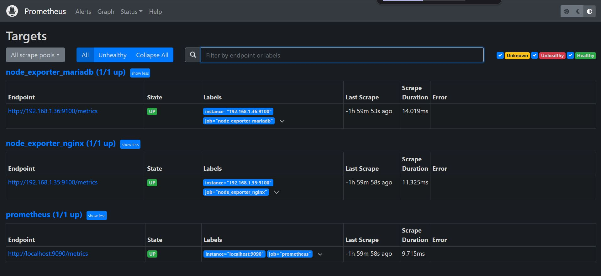

    # Infrastructure DevOps localisée sur Proxmox VE

Ce projet a pour but de créer une infrastructure DevOps locale virtualisée avec Proxmox VE.  
Elle inclut le provisionnement avec Terraform, la configuration automatisée avec Ansible,  
ainsi qu’un système de monitoring avec Prometheus + Grafana.

## Objectifs
- Automatiser le déploiement de machines virtuelles
- Déployer NGINX, MariaDB, Prometheus, Grafana
- Superviser les services via dashboard
- Comprendre les bonnes pratiques DevOps en environnement local

## Technologies utilisées
- Proxmox VE
- Terraform
- Ansible
- Prometheus + Grafana
- NGINX
- MariaDB

## Architecture

## 📸 Captures d'écran

### ✅ Ansible : Déploiement des rôles

### 🔐 NGINX sécurisé avec HTTPS

### 📊 Dashboard Grafana

### 🎯 Cibles Prometheus actives

## Auteur
HAMDI

